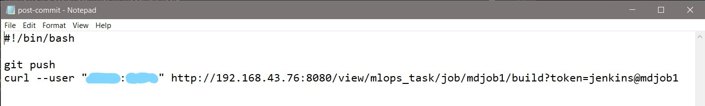

# ML_Hyperparameter_Modifier
> **Requirements**:
* docker
* git
* github account
* jenkins

>**Steps to use**:
* Create a github repository

* Clone the repository

* Configure git hooks

  
  This will push the update to github and trigger the jenkins job1 once you execute commit command.
  
* Configure jenkins job1

  
