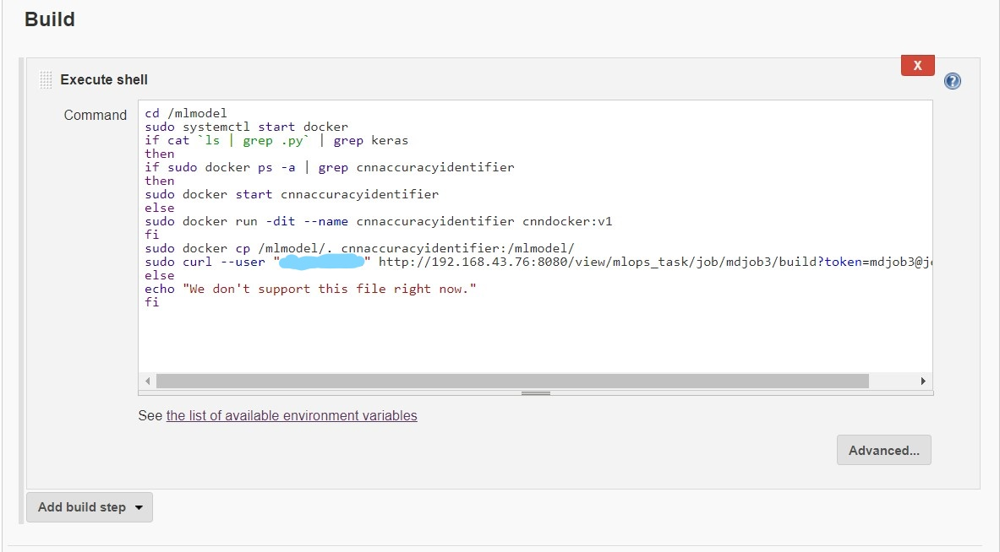
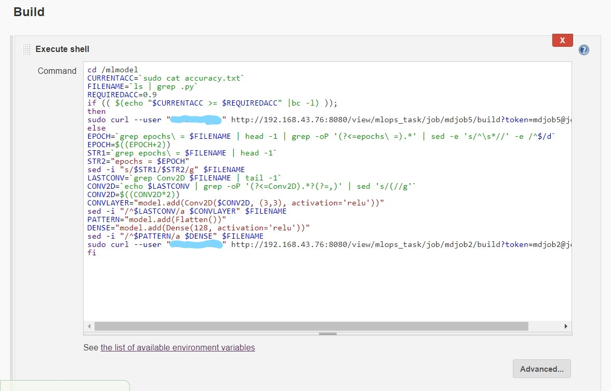

# ML_Hyperparameter_Modifier
>**Requirements**:
* docker

* git

* github account

* jenkins
  
>**Steps to use**:
* Create a github repository.
  
* Clone the repository.
  
* Configure git hooks.
  * 
     
  
  This will push the update to github and trigger jenkins job1 once you execute commit command.
  
* Configure jenkins job1 : Pull the github repo automatically when developer push repo to github.
  * 
    
  * 
   

  Job 1 will download the repo locally to the system when developer push repo to github and trigger job2 once job1 executed successfully.
    
* Create a docker image that is well suited for cnn models.
  * 
   
  
  This dockerfile create a centos image with python installed in it with some of its libraries (keras, numpy, pandas, tensorflow).
  
* Configure jenkins job2 : By analyzing the code job2 will automatically start the best container available.
  * 
    
  * 
   

  Job2 will analyze the code and check if the code is related to cnn and if it is then it will start the container, copy the downloaded repo inside the container and trigger job3. 
    
* Configure jenkins job3 : Train the model and predict the accuracy.
  * 
    
  * 
   

  Job3 will train the model and predict the accuracy,store the accuracy to a text file and trigger job4 once successfully executed job3.
    
* Configure jenkins job4 : If accuracy is less than 90% it will tweak model.
  * 
    
  * 
   
  
  Job4 will check the accuracy, if accuracy is less than 90% it will tweak the model by changing value of epochs, by adding convlayer and by adding dense layer and after that trigger job2 otherwise trigger job5.
  
* Configure jenkins job5 : Notify that best model has been created.
  * 
    
  
    
  * 
    
  * 
   
  
  Job5 will send the mail to the developer telling accuracy of the model.
  
* Configure jenkins job6 : If during execution container fails then it will restart the container.
  * 
   

  Job6 will watch the job3 and if at the time of training the model container fails it will trigger job2.